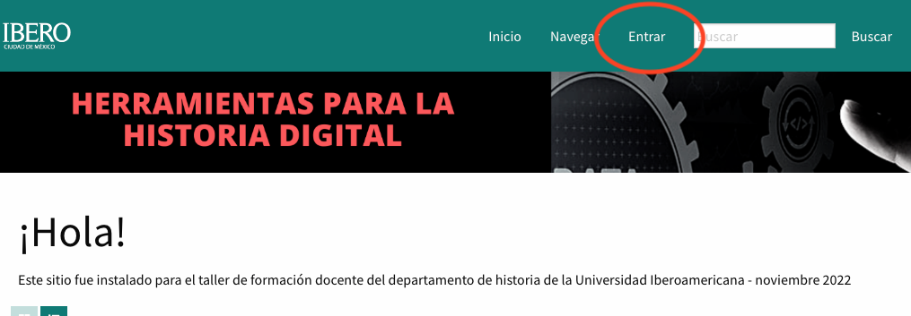
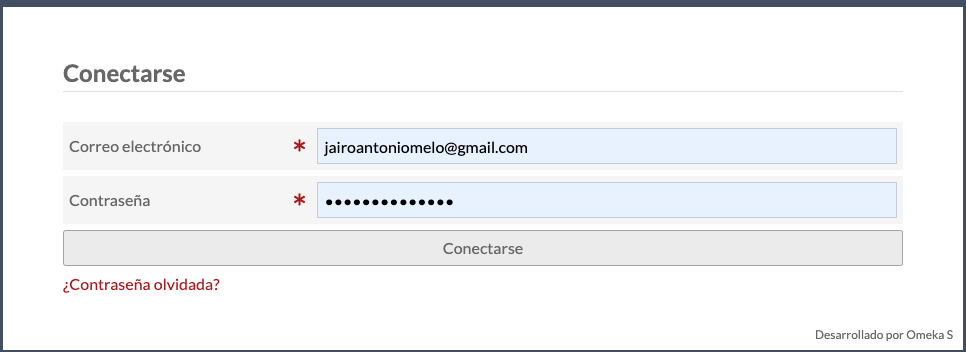
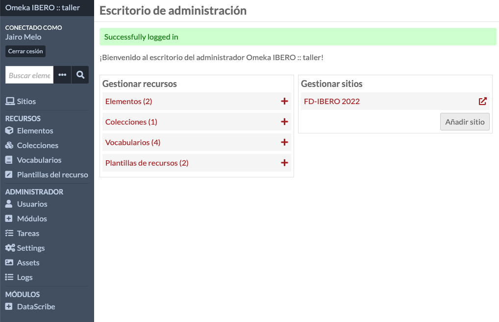

# Sesión 2 - Omeka

[//]: # (<>)

* Plataforma Omeka: [FD-IBERO 2022](http://157.245.245.48/omekas)
* Manual de usuario: [Omeka](https://omeka.org/s/docs/user-manual/)

[//]: # (<>)

## Instrucciones para ingresar a Omeka

1. Ingresar a la plataforma Omeka: [FD-IBERO 2022](http://157.245.245.48/omekas)
2. Hacer clic en el botón `Entrar`

    

3. Ingresar con usuario y contraseña:

    * Usuario: su correo electrónico
    * Contraseña (para todos): *alphabetagama*

4. Hacer clic en el botón `Conectarse`

    

5. ¡Ya está listo para comenzar a trabajar en Omeka!

    

[//]: # (<>)
